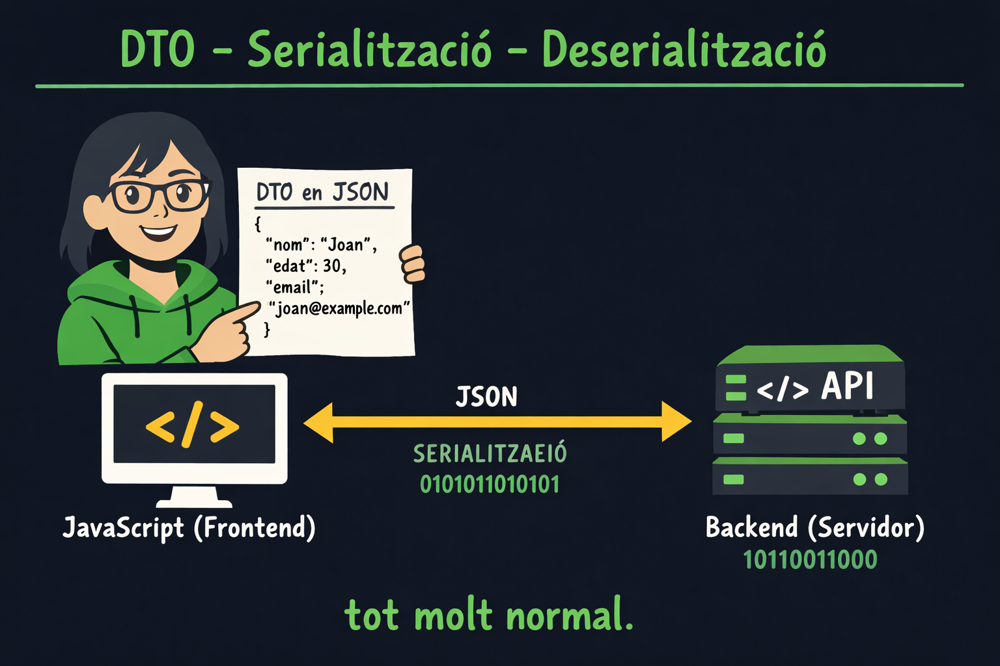

# Persistència

Anem a estudiar la persistència usant llenguatge de marques. Per fer això aprendrem a *serialitzar* objectes a un llenguatge de marques i desar-ho a disc i aprendrem a *deserialitzar* des de llenguatge de marques per tal d' 'hidratar' objectes.

## Conceptes clau

### Serialització

La **serialització** és el procés de convertir un objecte en memòria a un format que es pugui emmagatzemar (persistir) o transmetre. En el nostre cas, convertirem objectes C# a formats com JSON o XML per desar-los a disc.

### Deserialització

La **deserialització** és el procés invers: llegir dades d'un format (com JSON o XML) i convertir-les en objectes en memòria. Quan deserialitzem, hem d'indicar al deserialitzador quin tipus d'objecte esperem obtenir.

## Casos d´ús

Quan fem servir serialització i deserialització?

### DTO

El frontend i el backend s'envien entitats d'informació encapsulades en un llenguatge de marques. Serialitzen i deserialitzen la informació a cada extrem.

### Persistència

Persistir l'estat dels objectes per treurel's de memòria i hidratar-los més endavant quan es necessiti. Exemple: Paràmetres de preferències d'usuari.

## JSON

JSON (JavaScript Object Notation) és un format lleuger i fàcil de llegir. És el format més utilitzat en aplicacions web modernes.

| Tema | Descripció |
|------|------------|
| 📖 [Serialització JSON](./Content/json-serialitzacio.md) | Convertir objectes C# a JSON |
| 📖 [Deserialització JSON](./Content/json-deserialitzacio.md) | Convertir JSON a objectes C# |

## XML

XML (eXtensible Markup Language) és un format més verbós però molt potent per representar dades estructurades. És àmpliament utilitzat en sistemes empresarials i configuracions.

| Tema | Descripció |
|------|------------|
| 📖 [Serialització XML](./Content/xml-serialitzacio.md) | Convertir objectes C# a XML |
| 📖 [Deserialització XML](./Content/xml-deserialitzacio.md) | Convertir XML a objectes C# |

## Comparació JSON vs XML

| Característica | JSON | XML |
|----------------|------|-----|
| Llegibilitat | Més compacte | Més verbós |
| Mida | Menor | Major |
| Atributs | No en té | Sí (atributs i elements) |
| Espais de noms | No | Sí |
| Ús principal | APIs web, configuració | Sistemes empresarials, documents |

## Recursos

- [Documentació oficial de Microsoft - Serialització JSON](https://learn.microsoft.com/en-us/dotnet/standard/serialization/system-text-json/how-to)
- [Documentació oficial de Microsoft - Deserialització JSON](https://learn.microsoft.com/en-us/dotnet/standard/serialization/system-text-json/deserialization)
- [Documentació oficial de Microsoft - XmlSerializer](https://learn.microsoft.com/en-us/dotnet/standard/serialization/introducing-xml-serialization)

